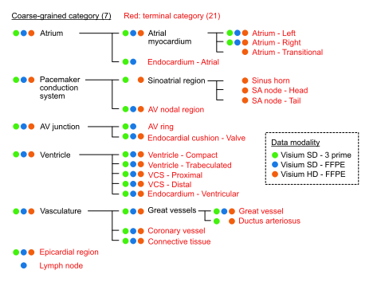

# TissueTypist

**Classify tissue niches in spatial transcriptomics data.**
Ships with a pre-trained cardiac classifier. Adapts to any tissue via
a single YAML file.

```python
from tissuetypist import predict_adata, load_preset
adata = predict_adata(
    adata,
    model_dir=load_preset("default"),
    modality="sd",
    section_col="section_ID",
)
adata.obs[["tt_final_label", "tt_coarse_score"]].head()
```

The cardiac classifier is trained on Visium SD (3-prime + FFPE) and Visium HD
reference data, with a YAML-driven hierarchy that you can extend or replace
for other tissues.



*Hierarchical organisation of anatomical labels used for model training.
Seven coarse-grained categories resolve into 21 fine-grained terminal
niches. Coloured dots indicate which reference modalities (Visium SD
3-prime, Visium SD FFPE, Visium HD FFPE) provide training data for each
label.*

---

## Install

```bash
conda env create -f environment.yml
conda activate tissuetypist
pip install -e ".[dev]"
```

Verify:

```bash
tissuetypist --version
tissuetypist info            # lists shipped presets + hierarchies
```

---

## The three things you'll do

### 1. Predict on Visium — use a shipped cardiac classifier

```bash
tissuetypist predict \
    --query       my_visium.h5ad \
    --model_dir   $(python -c "import tissuetypist; print(tissuetypist.load_preset('default'))") \
    --modality    sd \
    --section_col section_ID \
    --outdir      results/pred
```

Or, with plots + metrics in one step:

```bash
tissuetypist evaluate --query_sd my_visium.h5ad \
    --model_dir <preset_path> --modality sd --outdir results/eval
```

### 2. Retrain for an imaging panel (Xenium / MERFISH / CosMx)

Targeted panels need retraining on the panel's gene overlap:

```bash
tissuetypist train-panel \
    --query               merfish.h5ad \
    --reference           data/adata_sd_3p_raw.h5ad \
    --reference_secondary data/adata_sd_ffpe_raw.h5ad \
    --reference_tertiary  data/adata_hd_windows.h5ad \
    --gene_pools          results/phase0_pseudobulk/gene_pools.csv \
    --gene_lists_from     <preset_path> \
    --outdir              results/panel_merfish
```

### 3. Train on your own data — any tissue

Simplest case: single label column, no sub-hierarchy:

```bash
tissuetypist train \
    --reference my_data.h5ad \
    --outdir    results/my_run \
    --flat --coarse_col my_niche_column
```

For coarse + fine labels with 2-level hierarchy: swap `--flat` for
`--auto_infer --coarse_col ... --fine_col ...`. For a bespoke tissue
hierarchy: write your own YAML (see [docs/hierarchy.md](docs/hierarchy.md))
and pass `--hierarchy my_tissue.yaml`.

→ Full walkthroughs in [docs/user-guide.md](docs/user-guide.md).

---

## CLI reference

| Command | Purpose |
|---|---|
| `tissuetypist predict` | Run prediction; writes `{prefix}_predicted.h5ad` + summary. |
| `tissuetypist evaluate` | Predict + confusion matrix + spatial / UMAP / confidence plots. |
| `tissuetypist train` | Train on your own reference data — any tissue. Supports `--flat`, `--auto_infer`, or a custom YAML hierarchy. |
| `tissuetypist train-panel` | Retrain for an imaging-based ST panel (Xenium / MERFISH / CosMx). |

Every subcommand has its own `--help`. For the full set of subcommands
(including `info`, `build-catalogue`, `pseudobulk-hd`,
`validate-hierarchy`), see [`docs/user-guide.md`](docs/user-guide.md).

---

## What's in the output?

Every prediction adds a set of `tt_*` columns to `adata.obs`. The two
you'll use most:

| Column | Meaning |
|---|---|
| `tt_final_label` | Recommended per-spot label (finest resolved class). |
| `tt_coarse_score` | Confidence of the coarse-level prediction. |

→ Full schema in [docs/output-columns.md](docs/output-columns.md).

---

## Bring your own tissue

The niche hierarchy isn't hardcoded — it lives in a single YAML:

```
tissuetypist/config/hierarchies/cardiac.yaml
```

Copy it, edit the niche names / modalities / stages for your tissue,
and pass `--hierarchy my_tissue.yaml` at training time. Everything
downstream (training, prediction, plotting) adapts automatically.

→ Hierarchy concepts and the full YAML schema in
[docs/hierarchy.md](docs/hierarchy.md).

---

## Learn more

- **[docs/user-guide.md](docs/user-guide.md)** — step-by-step walkthroughs
  for every workflow (cardiac reproduction, non-cardiac training,
  imaging-based ST, evaluation).
- **[docs/hierarchy.md](docs/hierarchy.md)** — the cardiac niche hierarchy
  diagram, multi-stage sub-model chains, and the complete YAML spec.
- **[docs/output-columns.md](docs/output-columns.md)** — reference for
  every `tt_*` column TissueTypist writes.
- **[notebooks/](notebooks/)** — runnable example notebooks: prediction-only
  demo, MERFISH panel-specific retraining, lung LOSO evaluation, accuracy
  summary across modalities.

---

## Cite

If you use TissueTypist, please cite:

> Cranley J & Kanemaru K. et al. *Developmental Dynamics of Human
> Cardiogenesis: A multi-omic reference and its disruption in Trisomy 21*.
> bioRxiv 2025.
> [https://www.biorxiv.org/content/10.1101/2024.04.29.591736v3](https://www.biorxiv.org/content/10.1101/2024.04.29.591736v3)

## Acknowledgments

Documentation and code restructuring were assisted by Anthropic's Claude.

## License

MIT.
